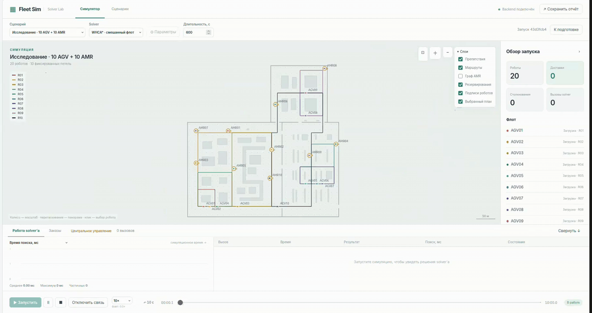

# Fleet Sim

Веб-симулятор флота мобильных роботов с простым fleet manager. Бэкенд на Python
(FastAPI), фронтенд на чистом HTML/Canvas. Симулятор загружает карту цеха (DXF),
граф маршрутов (GeoJSON), конфиг флота и сценарий заказов WMS, гоняет роботов по
графу, считает столкновения и проверяет порядок доставки (FIFO).

## Что умеет

- импорт 2D-карты из DXF (стены и препятствия превращаются в отрезки);
- импорт графа маршрутов из GeoJSON (узлы + рёбра, поиск кратчайшего пути);
- конфиг флота в JSON, сценарий заказов WMS в JSON;
- диспетчеризация заказов на ближайшего свободного робота;
- проверка столкновений робот-стена и робот-робот;
- проверка FIFO по каждому типу груза;
- ручное управление роботом с клавиатуры и выдача маршрута по узлам;
- экспорт статистики в JSON.

## Запуск

Нужен Python 3.12

```bash
cd fleet-sim
python3 -m venv .venv
source .venv/bin/activate
pip install -r requirements.txt
uvicorn backend.app.main:app
```

Дальше открыть в браузере:

```
http://localhost:8000
```

В разделе **Сценарии** доступны готовый пример и редактор. Для запуска перейдите
в **Симулятор**, выберите сценарий, solver и параметры, затем нажмите **Запустить**.



## Централизованный A* для 15 AGV

В разделе **Симулятор** выберите **Завод · 15 AGV / 10 петель**, затем **Запустить**: роботы выполняют
повторяющиеся доставки по десяти фиксированным петлям заводской карты. Совместный
A* согласовывает движение и ожидания с лимитом 200 мс на поиск.

## Структура

```
backend/      серверная часть (движок, роботы, карты, WMS, метрики, API)
frontend/     браузерная часть (Canvas-отрисовка и панель управления)
examples/     демо-карта, граф, флот и сценарий заказов
docs/         подробная документация
```

